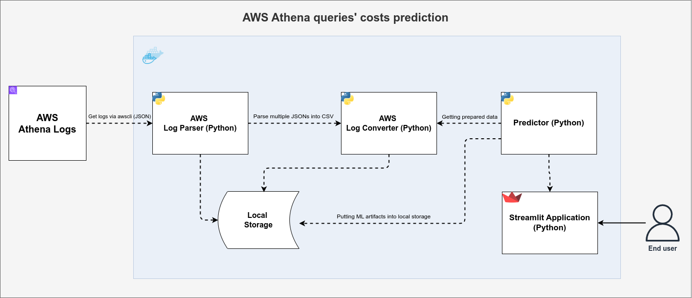
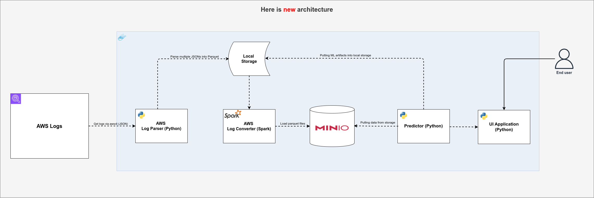

# Forecast Athena SQL Queries

This project comprises a suite of Python scripts designed to analyze SQL query logs and predict the memory usage of SQL queries. It involves downloading query logs from AWS Athena, processing these logs, and using machine learning to predict the memory usage of SQL queries.

## Project Diagrams

### Current Architecture Diagram

### New Architecture Diagram

## License

[Apache License 2.0](LICENSE)
